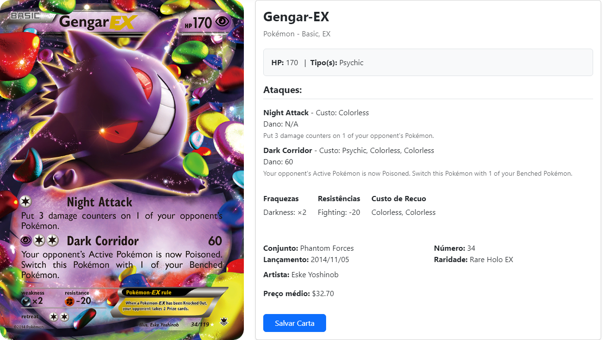

<!DOCTYPE html>
<html lang="pt-BR">
<head>
  <meta charset="UTF-8" />
  <title>TCG-CARD</title>
  
</head>
<body>

  <h1>🃏 TCG-CARD</h1>
  
<strong>Projeto desenvolvido com React, Vite e para buscar e salvar cartas de Pokémon usando a API oficial:</strong> <a href="https://pokemontcg.io ">Pokémon Trading Card Game API</a>

  

    <h2>🚀 Sobre</h2>
    
O <strong>TCG-CARD</strong> é uma aplicação web que permite aos usuários <strong>buscar cartas de Pokémon</strong> através da <strong>Pokémon Trading Card Game API</strong>, exibindo informações detalhadas como nome, tipo, ataques, habilidades, imagem e muito mais.

    
Além disso, os usuários podem <strong>salvar suas cartas favoritas</strong>

  

  

  <h2>🔍 Funcionalidades</h2>
  <ul>
    <li>✅ Busca por nome, os pokemons suportados pela API</li>
    <li>📄 Exibe dados completos das cartas (nome, imagem, habilidades, ataques, tipos, etc.)</li>
    <li>💾 Salva cartas selecionadas</li>
    <li>🗑️ Remove cartas salvas quando necessário</li>
    <li>🌐 Integração direta com a <a href="https://pokemontcg.io ">Pokémon TCG API</a></li>
  </ul>

  <h2>🛠 Tecnologias utilizadas</h2>
  <ul>
    <li>React – Interface interativa e componentes reutilizáveis</li>
    <li>Vite – Ambiente de desenvolvimento rápido e eficiente</li>
  </ul>

  <h2>📦 Como rodar o projeto</h2>
  <pre><code>git clone https://github.com/Alison-de-Oliveira/TCG-CARD.git  cd tcg-card npm install npm run dev</code></pre>

  

    
Alison de Oliveira

  

</body>
</html>